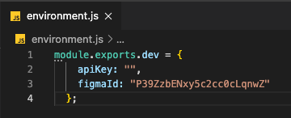

# Demo design token de Curso Análisis componentes visuales + figma

Esta demo tiene como objetivo enseñar una muestra de la implementación de los design token generando una arquitectura multiplataforma utilizando [Style Dictionary](https://amzn.github.io/style-dictionary/#/) y la API de [Figma](https://www.figma.com/)


Para el correcto funcionamiento de la demo deberás hacer lo siguiente:

- Ejecutar el comando ```npm install``` donde instalaremos las dependencias necesarias
- Crear un archivo ```environment.js``` en la raíz del proyecto simulando misma estructura y añadiendo tu api key personal de figma

    

- Ejecutar el comando ```npm run build```


